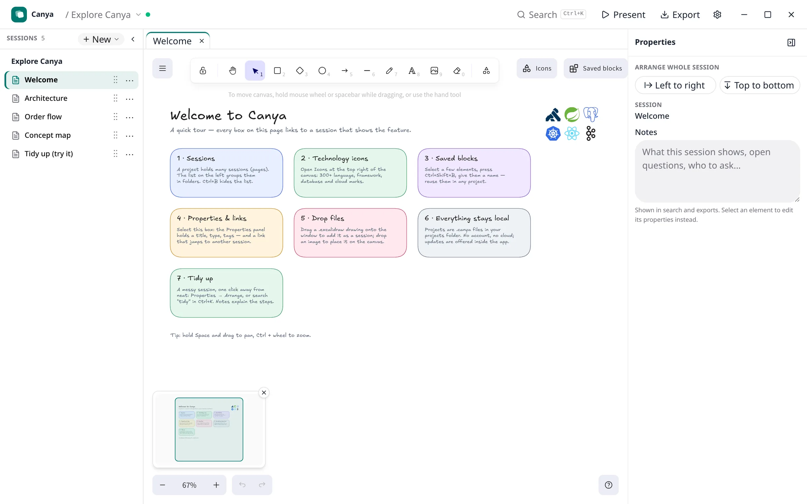
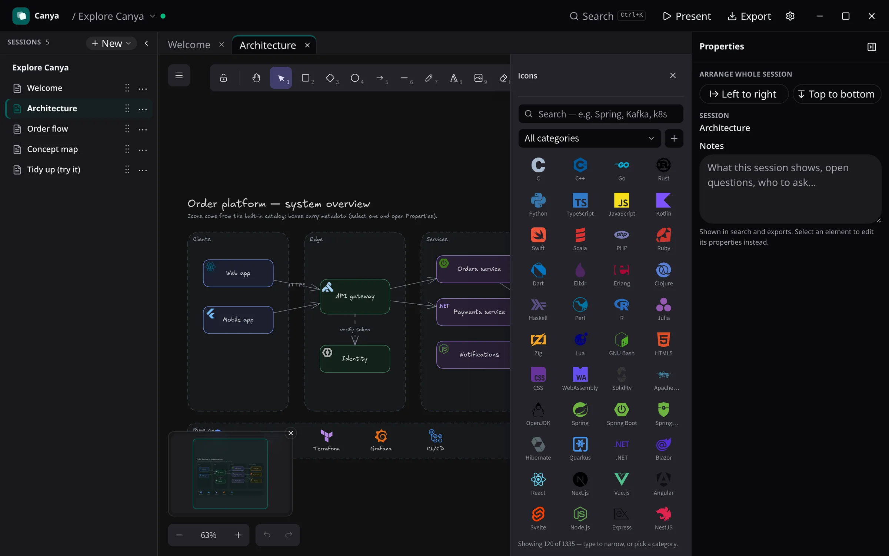

Canya is a desktop app for drawing system diagrams, architecture sketches and visual docs. It is built on Tauri 2 and React with an Excalidraw canvas underneath, and it is deliberately offline: there is no account system, no backend, no cloud storage and no telemetry. Every project is a versioned JSON file (`.canya`) on your own disk.

## What it does

- **Sessions and folders.** Organise pages into a tree, open them as tabs above the canvas, drag them around or move them with the keyboard.
- **Icon catalog.** Bundled technology icons from Simple Icons and Devicon, plus the official AWS, Azure and Google Cloud architecture icon sets loaded on demand.
- **Block libraries.** Twelve built-in libraries from the excalidraw-libraries collection.
- **Native app bar.** The window draws its own title bar with the project name, a save-status dot, settings and window controls.
- **Autosave and close protection.** Content changes are saved after a short debounce; `Ctrl/Cmd+S` saves immediately; the window will not close with unsaved work.
- **Import from Link.** The single network call the app makes: a user-initiated fetch of an `https://` project file, validated with the same schema used for local files.

## Under the hood

The repository is a Bun workspace: a Tauri 2 shell with a minimal Rust bootstrap, a React/TypeScript/Vite frontend, `@excalidraw/excalidraw` behind an internal adapter package, a platform-independent domain package for the project model and schemas, and a project-storage package that owns versioned JSON serialization and atomic file persistence. Quality gates are Biome, strict TypeScript, Vitest, `rustfmt` and Clippy.

Releases are built by GitHub Actions for macOS (universal), Windows and Linux, signed with a Tauri updater key, and published to the [canya-site](https://github.com/burak-kayaa/canya-site/releases) repository. Installed copies check `latest.json` once at startup (this can be turned off in Settings). Arch users get an AUR package that repackages the AppImage.

[Download Canya](https://canya.burkaya.com) · [Report an issue](https://github.com/burak-kayaa/canya-site/issues)
