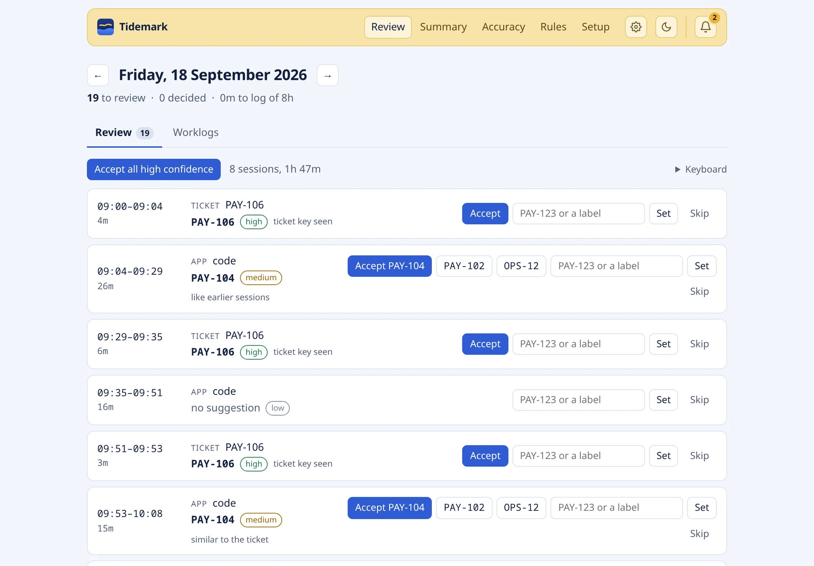
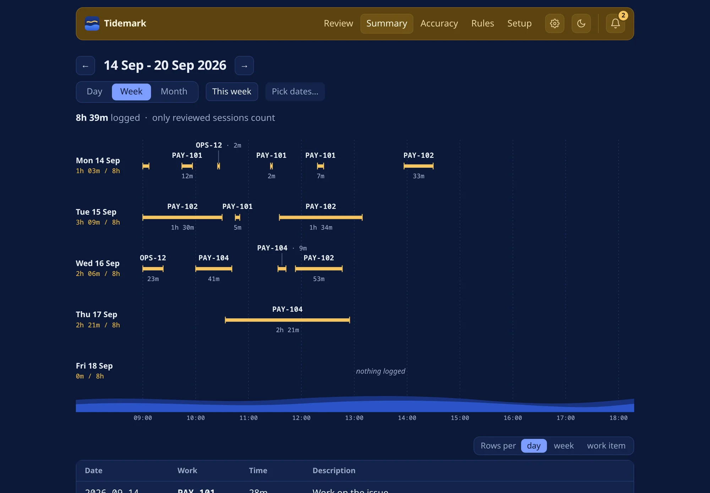

Tidemark runs on your computer and follows what you work on: windows, browser tabs, terminal commands, git commits and calendar meetings. At the end of the day it hands you the day's worklogs to check: which ticket or job, from when to when, what you did. Fix what is wrong, then publish to Jira or write them into the spreadsheet your team already keeps. It is out for Windows and Apple Silicon Macs, and runs on Linux with uv.

## What it does

- **Suggests the work.** Each session of the day comes with the ticket or job it most likely belongs to and how sure it is: from ticket keys in branches, titles, URLs and commit messages, from rules it learns from your decisions, and from the likeness of a session to earlier ones and to the open tickets.
- **Keeps review short.** Accept every sure suggestion at once, step through the rest from the keyboard, and let it skip what keeps being skipped.
- **Fits how you report.** Show it the Excel file you fill in and it learns the columns, their choices and the date format, then writes your work into it row by row, each row shown first. Jira, Excel Online, CSV and plain text work too.
- **Counts what the computer can't see.** Meetings from your calendar, and after a long break it asks whether to log the time away.
- **Keeps the day honest.** End-of-day reminders, days that fall short of your working hours pointed out, and worklogs split where you took a long break.
- **Answers questions.** An MCP server lets Claude tell you what you worked on or write your standup from your reviewed work.

## Under the hood

A Python 3.12 service built with ports and adapters: a pure domain layer (sessionizing, matching, scoring) with no I/O, FastAPI with server-rendered Jinja2 and HTMX for the interface, SQLite for storage, and ActivityWatch for collecting window and browser activity. Matching combines rules, kNN over earlier decisions and embedding similarity with a local multilingual model on the CPU; a replayable evaluation harness scores every change. A Qt tray app wraps the same pages in a window.

Privacy is a rule, not a setting: everything runs on `127.0.0.1`, recorded activity stays in one file on your disk, old activity is deleted after 90 days, and Claude sees your work only if you connect it, through MCP.

[Download](https://tidemark.burkaya.com/#download) · [Visit the site](https://tidemark.burkaya.com) · [Releases](https://github.com/burak-kayaa/tidemark-site/releases)
